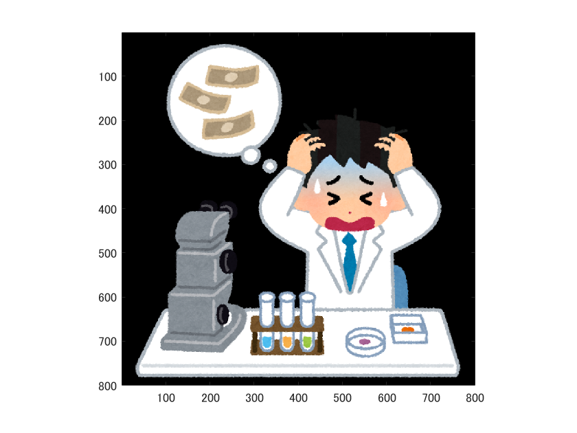
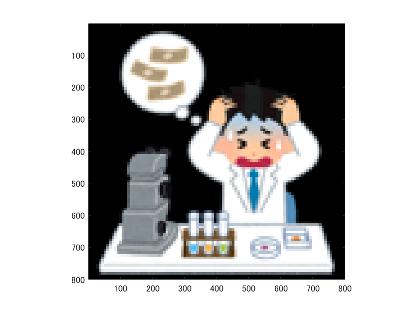

# 標本化間隔と解像度

      ORG=imread('../img/origin.png');
      imagesc(ORG); axis image;
  
  によって，原画像を読み込み，表示した結果を図１に示す．
  
  
  
図1 原画像

  
  原画像を1/2サンプリングするには，画像を1/2倍に縮小した後，2倍に拡大すればよい．なお，拡大する際には，単純補間するために「box」オプションを設定する．
  
      IMG = imresize(ORG,0.5); 
      IMG2 = imresize(IMG,2,'box');
  
  1/2サンプリングの結果を図２に示す．
  
  
  
図2 1/2サンプリング

  
  同様に原画像を1/4サンプリングするには，画像を1/2倍に縮小した後，2倍に拡大すればよい．すなわち，
  
      IMG = imresize(ORG,0.5);
      IMG2 = imresize(IMG,2,'box');
  
  とする．1/4サンプリングの結果を図３に示す．
  
  
  
図3 1/4サンプリング

  
  1/8から1/32サンプリングは，
  
      IMG = imresize(ORG,0.5);
      IMG2 = imresize(IMG,2,'box');
  
  を繰り返す．サンプリングの結果を図４～６に示す．
  
  
  
図4 1/8サンプリング

    
  
図5 1/16サンプリング

  
    
  
図6 1/32サンプリング</cebter>
  
  このようにサンプリング幅が大きくなると，モザイク状のサンプリング歪みが発生する．
