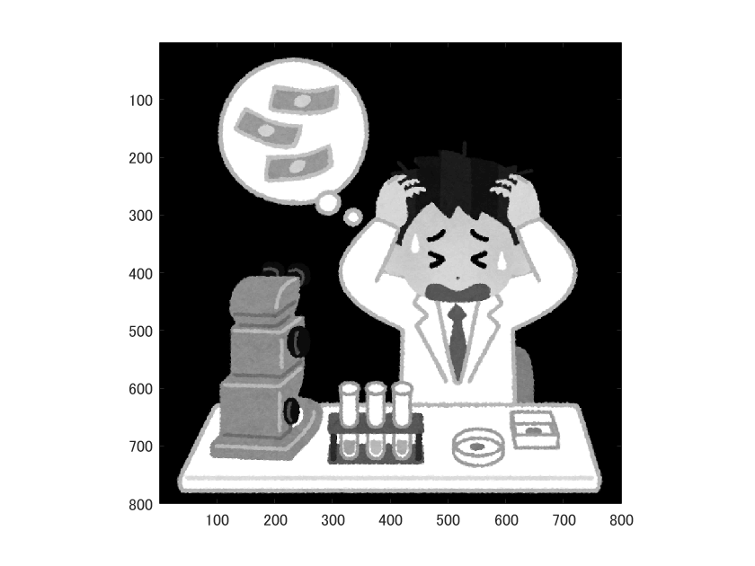
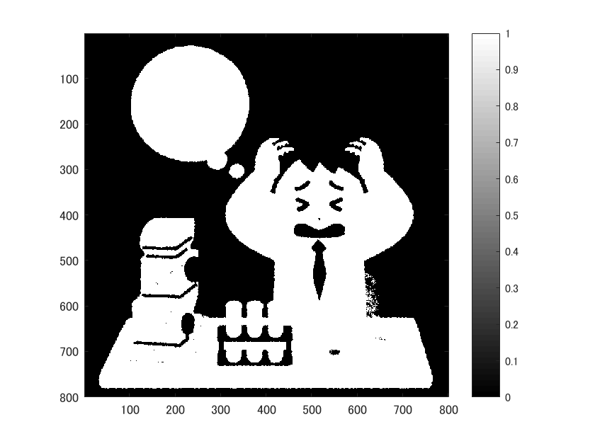
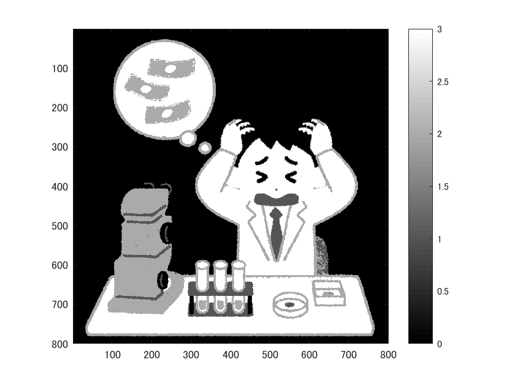
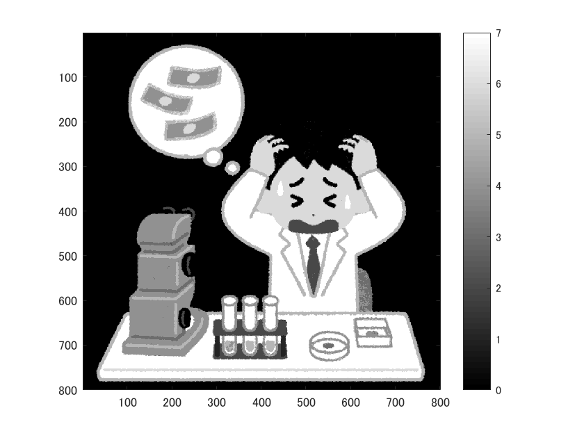

# 階調数と疑似輪郭
  
      ORG=imread('../img/origin.png');
      ORG = rgb2gray(ORG); colormap(gray); colorbar;
      imagesc(ORG); axis image;

  によって原画像の読み込み、グレースケールへの変換、表示した結果を図1に示す。

  
  
図1. グレースケール変換

  この画像を2階調化して表示するには、輝度によって2分割し、表示させればよい。すなわち、

  　  IMG = ORG > 128;
      imagesc(IMG); colormap(gray); colorbar; axis image;

  とすればよい。その結果を図2に示す。
  
  
  
図2. 2階調変換

  また、4階調化して表示するには、同様に、輝度によって4分割し、表示させればよい。すなわち、

      IMG0 = ORG > 64;
      IMG1 = ORG > 128;
      IMG2 = ORG > 192;
      IMG = IMG0 + IMG1 + IMG2;
      imagesc(IMG); colormap(gray); colorbar; axis image;

  とすればよい。その結果を図3に示す。

  
  
図3. 4階調変換

  また、8階調化して表示する場合も同様に輝度によって8分割・合成し、表示させればよい。すなわち、

      IMG0 = ORG > 32;
      IMG1 = ORG > 64;
      IMG2 = ORG > 96;
      IMG3 = ORG > 128;
      IMG4 = ORG > 160;
      IMG5 = ORG > 192;
      IMG6 = ORG > 224;
      IMG7 = ORG > 256;
      IMG = IMG0 + IMG1 + IMG2 + IMG3 + IMG4 + IMG5 + IMG6 + IMG7;
      imagesc(IMG); colormap(gray); colorbar; axis image;
  
  とすればよい。その結果を図4に示す。

  
  
図4. 8階調変換

