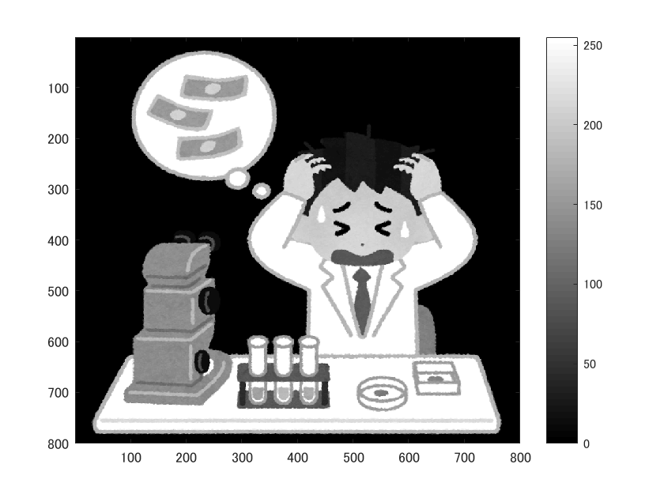
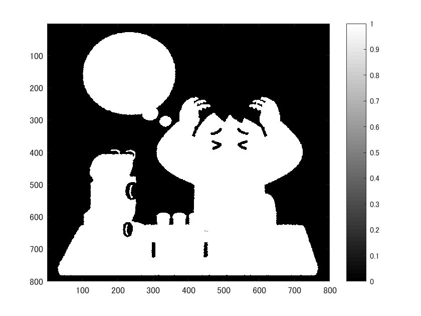
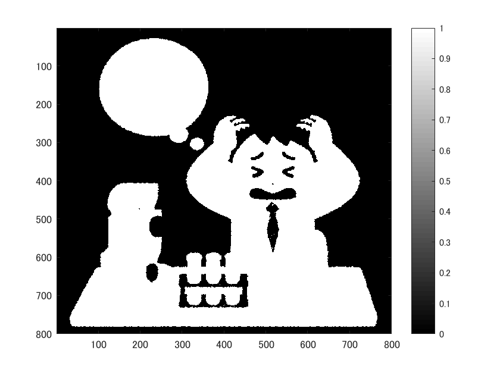
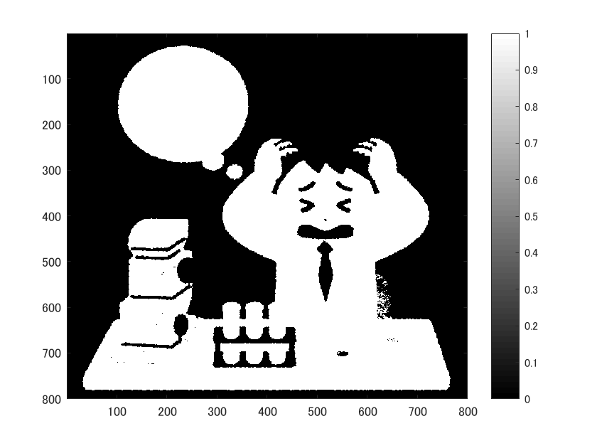
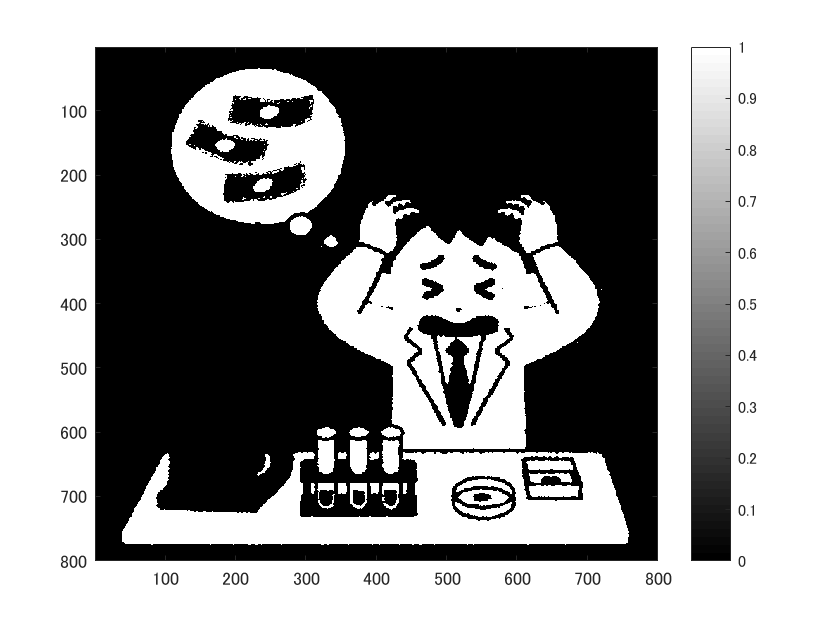

# 閾値処理
  
  画像の閾値処理を経験した旨を以下に記す。

      ORG = imread('../img/origin.png');
      ORG = rgb2gray(ORG);
      imagesc(ORG); colormap(gray); colorbar;

  によって画像をグレースケール変換し、カラーバー付きで表示する。その結果を図1に示す。

  
  
図1. グレースケール変換

  グレースケール変換した画像の輝度値が64以上の画素を取り出すには、

      IMG = ORG > 64;

  とする。またそうして処理した画像を表示するには、
  
      imagesc(IMG); colormap(gray); colorbar;

  とする。そうして表示した結果を図2に示す。

  
  
図2. 輝度値64以上の画素取り出し

  また、

      IMG = OGR > n;

  のnに適当な数値を指定することで、任意の輝度値の画素を取り出すことができる。
  表示する場合は、同様にimagescメソッドを用いればよい。

  以下に、nに96, 128, 192を指定した例を図4~図5に示す。

  
  
図3. 輝度値96以上の画素取り出し

  
  
図4. 輝度値128以上の画素取り出し

  
  
図5. 輝度値196以上の画素取り出し

