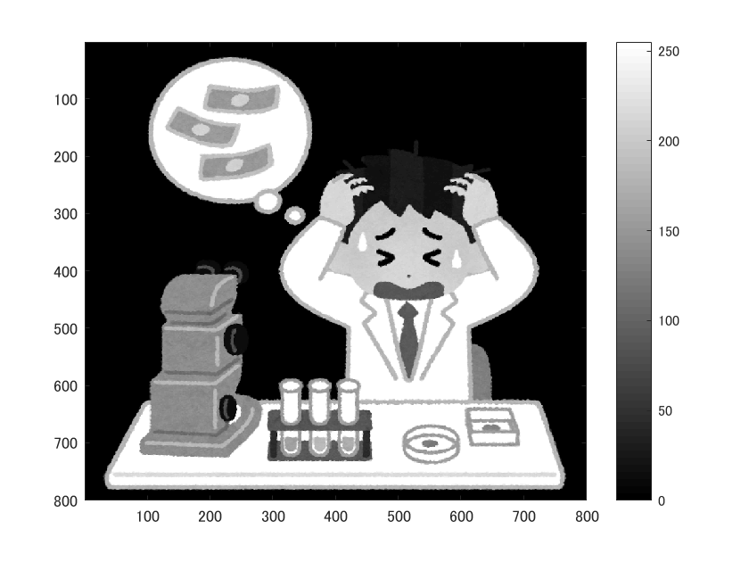
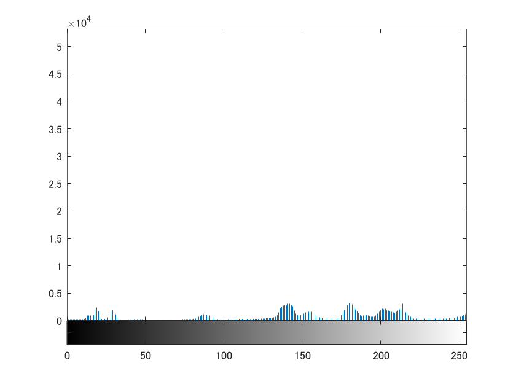

# 画像のヒストグラム
  
  画像の濃度のヒストグラム生成を経験した旨を以下に記す。

      ORG = imread('../img/origin.png');
      ORG = rgb2gray(ORG);
      imagesc(ORG); colormap; colorbar;

  により、画像を読み込み、グレースケールへと変換し、表示する。その結果を図1に示す。

  
  
図1. グレースケール変換

  また、
  
      imhist(ORG);
  
  により、画像ORGのヒストグラムを表示できる。その結果を図2に示す。

  
  
図2. グレースケール変換したorigin.pngのヒストグラム

  
