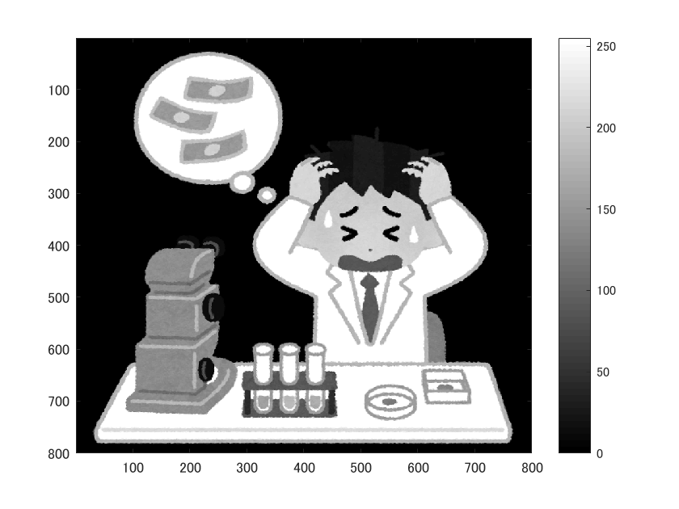
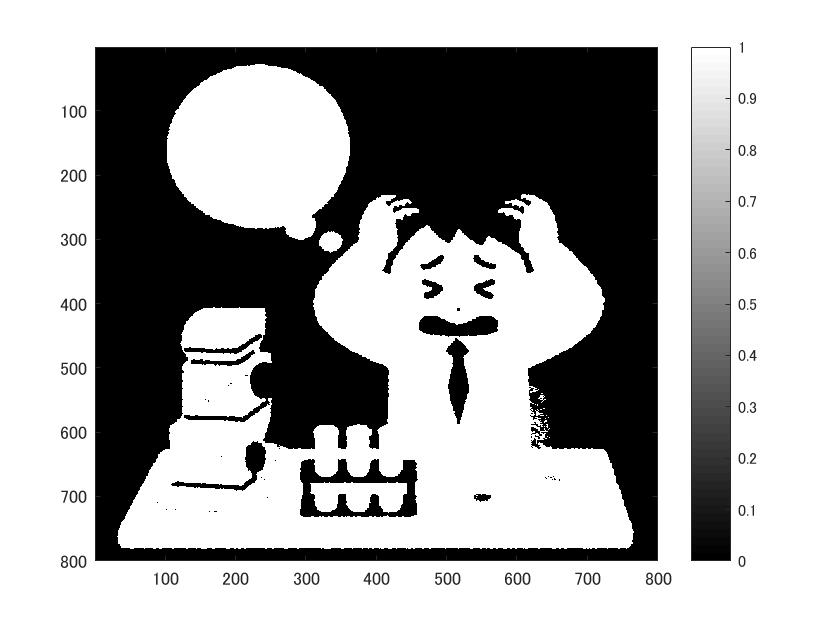

# 画像の二値化
  
  画像を二値化する処理を経験した旨を以下に記す。

      ORG = imread('../img/origin.png');
      ORG = rbg2gray(ORG);
      imagesc(IMG); colormap(gray); colorbar;
  
  により、画像を読み込み、グレースケールへと変換し、表示する。その結果を図1に示す。

  
  
図1. グレースケール変換

  
  
  ここで
  
      IMG = ORG > 128;
      imagesc(IMG); colormap(gray); colorbar;

  とすることで、輝度値が128以上の画素を抽出し、表示する。その結果を図2に示す。

  
  
図2. 輝度値による二値化

  また、

      IMG = dither(ORG);
      imagesc(ORG); colormap; colorbar;

  とすることで、ディザ法によって画像を二値化し、表示する、その結果を図3に示す。

  
  
図3. ディザ法による二値化

      
