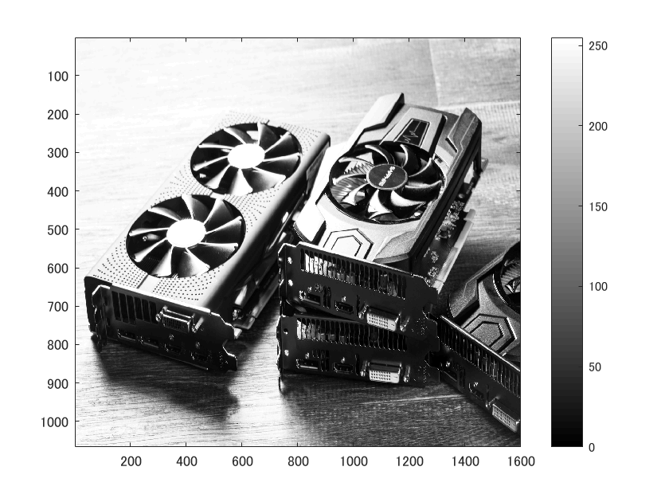
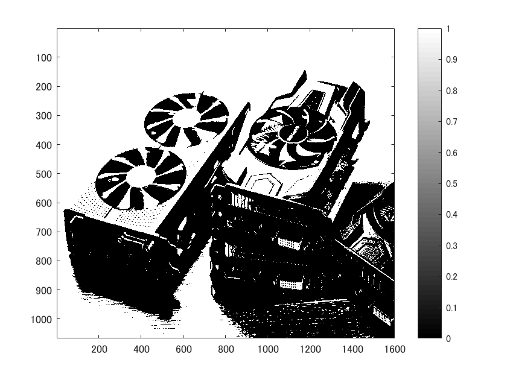
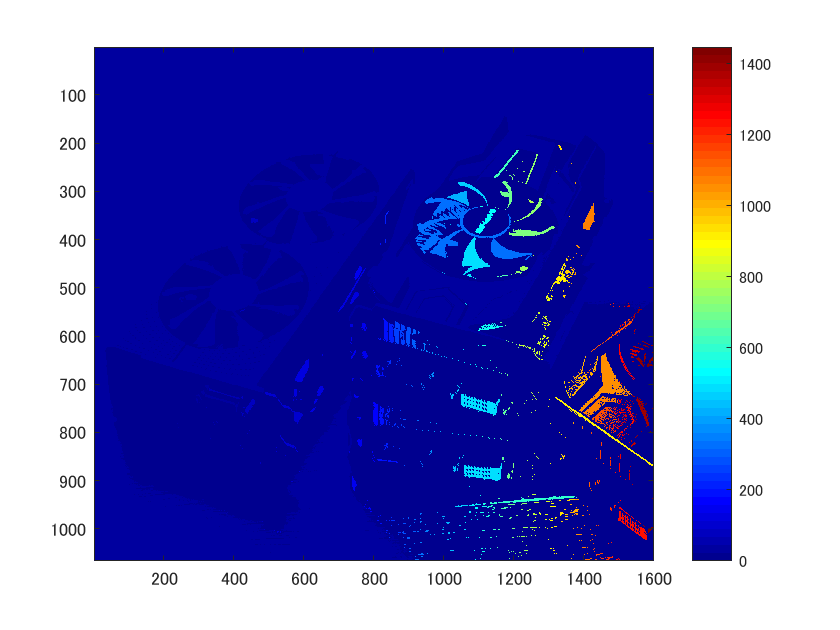

# ラベリング
  
  ラベリングを経験した旨を以下に記す。
  また、今回のみ入力する画像が不適であると判断したため、[GPUマイニング用の複数台のグラフィックボード](https://www.pakutaso.com/20170735192gpu.html)の画像を用いた。

  まず、画像を読み込み、グレースケール変換する。そのためには、次のようにすればよい。

      ORG = imread('../img/origin.png');
      ORG = rgb2gray(ORG);
      imagesc(ORG); colormap(gray); colorbar;

  また、そうしてカラーバー付きで表示した結果を図1に示す。

  
  
図1. グレースケール変換

  

  この画像を輝度値128を基準に二値化、表示するには、
  
      IMG = ORG > 128;
      imagesc(IMG); colormap(gray); colorbar;

  とすればよい。そうして表示した結果を図2に示す。

  
  
図2. 輝度値128を基準とした二値化

  また、二値化した画像をラベリングし、表示するには、

      IMG = bwlabeln(IMG);
      imagesc(IMG); colormap(jet); colorbar;
  
  とすればよい。そうして表示した結果を図3に示す。

  
  
図3. 二値化した画像のラベリング

