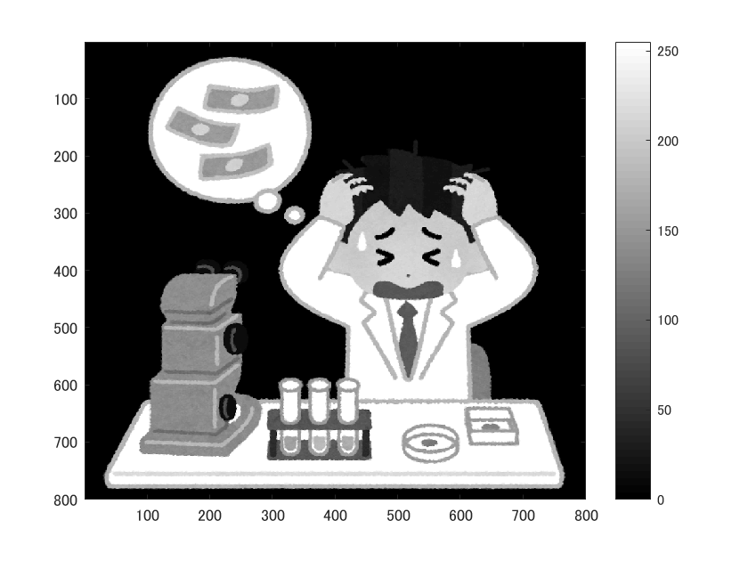
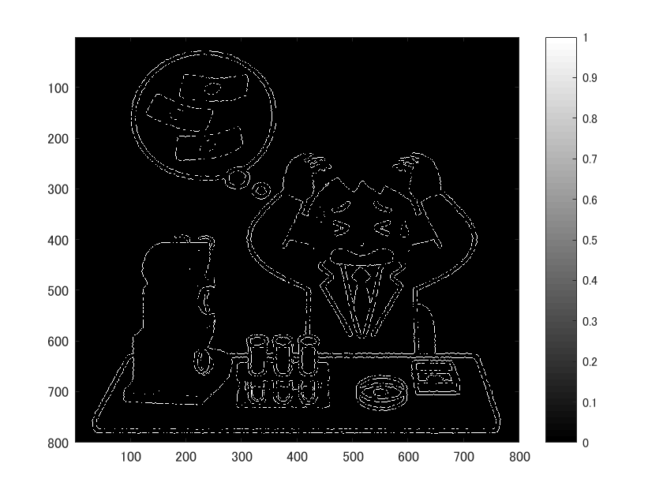

# 画像のエッジ抽出
  
  画像の閾値処理を経験した旨を以下に記す。

      ORG = imread('../img/origin.png');
      ORG = rgb2gray(ORG);
      imagesc(ORG); colormap(gray); colorbar;

  によって画像をグレースケール変換し、カラーバー付きで表示する。その結果を図1に示す。

  
  
図1. グレースケール変換

  この画像をエッジ抽出するには、egdeメソッドを用いればよい。すなわち、

      IMG = edge(ORG, 'prewitt');
      imagesc(IMG); colormap(gray); colorbar;

  とすればよい。また、「prewitt」を「sobel」, 「canny」に置き換えることで、エッジ抽出に利用するアルゴリズムを指定することができる。そうして実行、表示した例を図2~4に示す。
  
  
  <mid>図2. プレウィット法によるエッジ抽出

  
  <mid>図3. ソベル法によるエッジ抽出

  
  <mid>図4. キャニー法によるエッジ抽出

